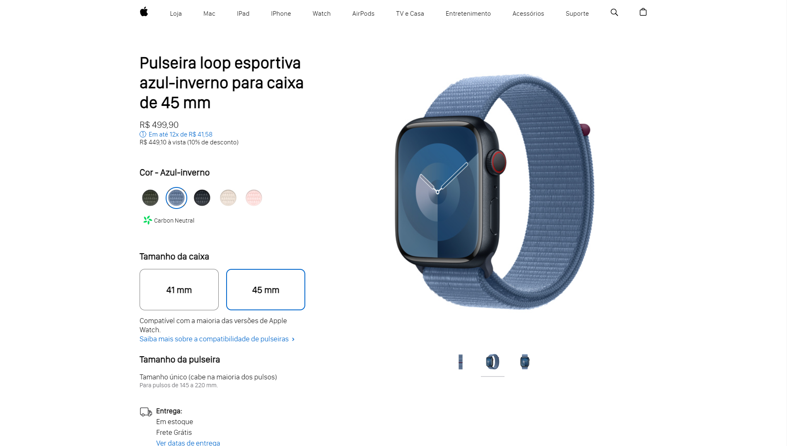

<h1 align="center"> Apple watch Page </h1>

Project developed during the Hashtag Programação event.

  <a href="#-technologies">Technologies</a>&nbsp;&nbsp;&nbsp;|&nbsp;&nbsp;&nbsp;
  <a href="#-Project">Project</a>&nbsp;&nbsp;&nbsp;|&nbsp;&nbsp;&nbsp;
  <a href="#memo-License">License</a>&nbsp;&nbsp;&nbsp;|&nbsp;&nbsp;&nbsp;

  

 

  

## 🚀 Technologies

This project was developed using the following technologies:

- HTML5
- JavaScript
- CSS3

## 💻 Project

We recreated the Apple Watch products page, offering a variety of items. You can switch between products to view them better.

## :memo: License

This project is under the MIT license.

---

